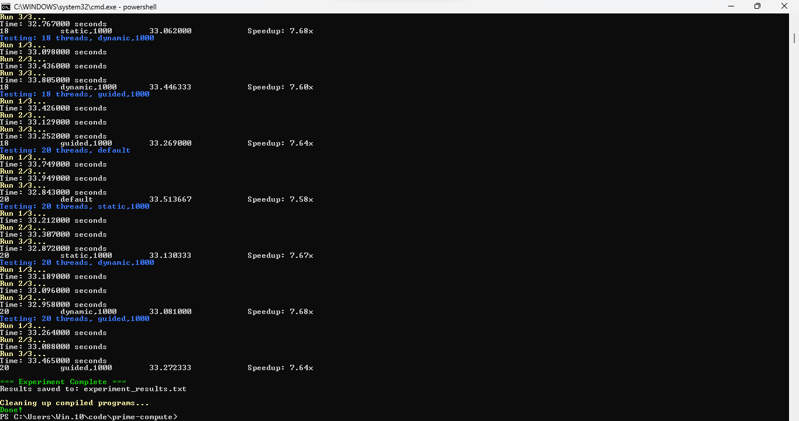

# Prime Number Counting Parallel Computing Lab Report

**Student Name:** Sara Al-Thubaity  
**University ID:** 444005842

---

## A. Machine Details

**CPU Model:** 11th Gen Intel(R) Core(TM) i3-1125G4 @ 2.00GHz  
**Number of Cores:** 4  
**Number of Logical Processors:** 8  
**Max Clock Speed:** 1997 MHz

**Memory Information:**  
**Total RAM:** 3.75 GB  
**Available RAM:** 0.24 GB

**Operating System:**  
**OS:** Microsoft Windows 11 Pro  
**Architecture:** 64-bit

**Additional System Information:**  
**Computer Name:** DESKTOP-RU1G1HM

## B. Compiler Information

**Compiler Version:** GCC 15.2.1 20250813  
**Compilation Flags Used:** `-O3 -fopenmp -Wall`

## C. Screenshots

### Run Output

## D. Results Table

| Threads    | Schedule         | Execution Time (s) | Notes (Speedup vs Serial) |
| :--------- | :--------------- | :----------------- | :------------------------ |
| **Serial** | --               | 254.036            | Baseline                  |
| 2          | static (default) | 96.928             | Speedup: 2.62x            |
| 2          | static,1000      | 86.523             | Speedup: 2.94x            |
| 2          | dynamic,1000     | 107.755            | Speedup: 2.36x            |
| 2          | guided,1000      | 105.263            | Speedup: 2.41x            |
| 4          | static (default) | 59.253             | Speedup: 4.29x            |
| 4          | static,1000      | 63.031             | Speedup: 4.03x            |
| 4          | dynamic,1000     | 57.417             | Speedup: 4.42x            |
| 4          | guided,1000      | 55.500             | Speedup: 4.58x            |
| 6          | static (default) | 43.973             | Speedup: 5.78x            |
| 6          | static,1000      | 45.679             | Speedup: 5.56x            |
| 6          | dynamic,1000     | 46.190             | Speedup: 5.50x            |
| 6          | guided,1000      | 40.843             | Speedup: 6.22x            |
| 8          | static (default) | 35.948             | Speedup: 7.07x            |
| 8          | static,1000      | 36.919             | Speedup: 6.88x            |
| 8          | dynamic,1000     | 36.370             | Speedup: 6.98x            |
| 8          | guided,1000      | 35.935             | Speedup: 7.07x            |
| 16         | static (default) | 33.812             | Speedup: 7.51x            |
| 16         | static,1000      | 33.688             | Speedup: 7.54x            |
| 16         | dynamic,1000     | 34.032             | Speedup: 7.46x            |
| 16         | guided,1000      | 33.643             | Speedup: 7.55x            |
| 18         | static (default) | 33.347             | Speedup: 7.62x            |
| 18         | static,1000      | 33.062             | Speedup: 7.68x            |
| 18         | dynamic,1000     | 33.446             | Speedup: 7.60x            |
| 18         | guided,1000      | 33.269             | Speedup: 7.64x            |
| 20         | static (default) | 33.514             | Speedup: 7.58x            |
| 20         | static,1000      | 33.130             | Speedup: 7.67x            |
| 20         | dynamic,1000     | 33.081             | Speedup: 7.68x            |
| 20         | guided,1000      | 33.272             | Speedup: 7.64x            |

## E. Discussion

### Best Performance

The best performance was achieved with **6 threads using the guided,1000 schedule**, with an average execution time of **40.843 seconds**, resulting in a **6.22x speedup** compared to the serial baseline of 254.036 seconds. This combination provided the optimal balance between parallelization benefits and scheduling overhead.

### Thread Scaling

Increasing the number of threads did not consistently improve performance. While there were significant improvements from 2 threads (2.94x speedup) to 6 threads (6.22x speedup), the performance gains became marginal beyond 8 threads. For example:

- 2 threads: maximum speedup of 2.94x
- 4 threads: maximum speedup of 4.58x
- 6 threads: maximum speedup of 6.22x (peak performance)
- 8 threads: maximum speedup of 7.07x
- Beyond 8 threads, speedups only improved slightly to 7.68x at 20 threads

This non-linear scaling can be attributed to several factors:

- **Scheduling overhead**: As more threads are created, the OpenMP runtime needs to manage and coordinate more threads, introducing overhead
- **Memory bandwidth limitations**: With only 4 physical cores, threads beyond this number compete for the same processing resources
- **Load imbalance**: Some threads may finish their work faster than others, leading to idle cores while waiting for slower threads to complete

### Diminishing Returns

The point of diminishing returns was reached around **8 threads**, where additional threads provided minimal performance improvement. From 16 to 20 threads, the speedup only increased from 7.55x to 7.68x (approximately 2% improvement), while execution time decreased by less than 1 second on average.

Performance levels off as thread count increases because:

- The system has only 4 physical cores, so adding more threads (up to 20) creates oversubscription where threads compete for CPU resources
- Memory bandwidth becomes a bottleneck as multiple threads access the large 200 million element array simultaneously
- Context switching overhead between threads reduces overall efficiency
- The parallel portion of the algorithm becomes saturated, and further thread increases only add coordination overhead without proportional work reduction

The guided scheduling performed best overall because it adapts chunk sizes dynamically during execution, providing better load balancing compared to static scheduling, while avoiding some of the runtime overhead of dynamic scheduling.
